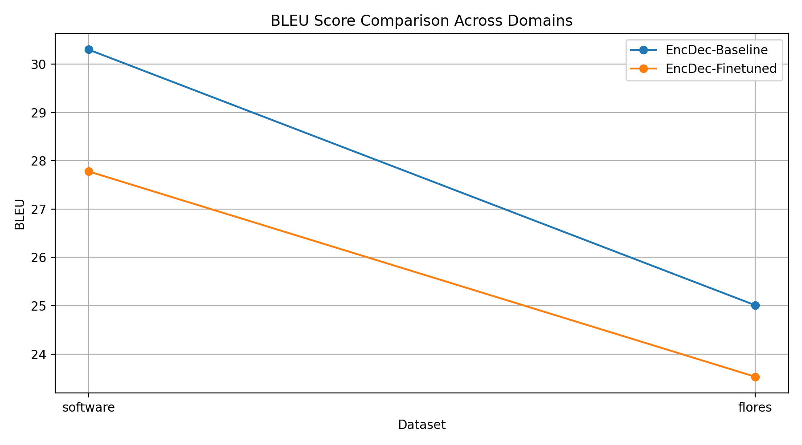
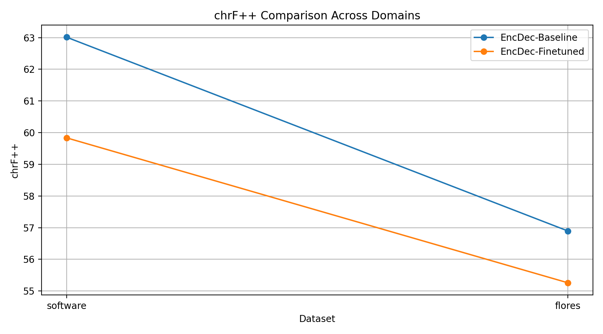
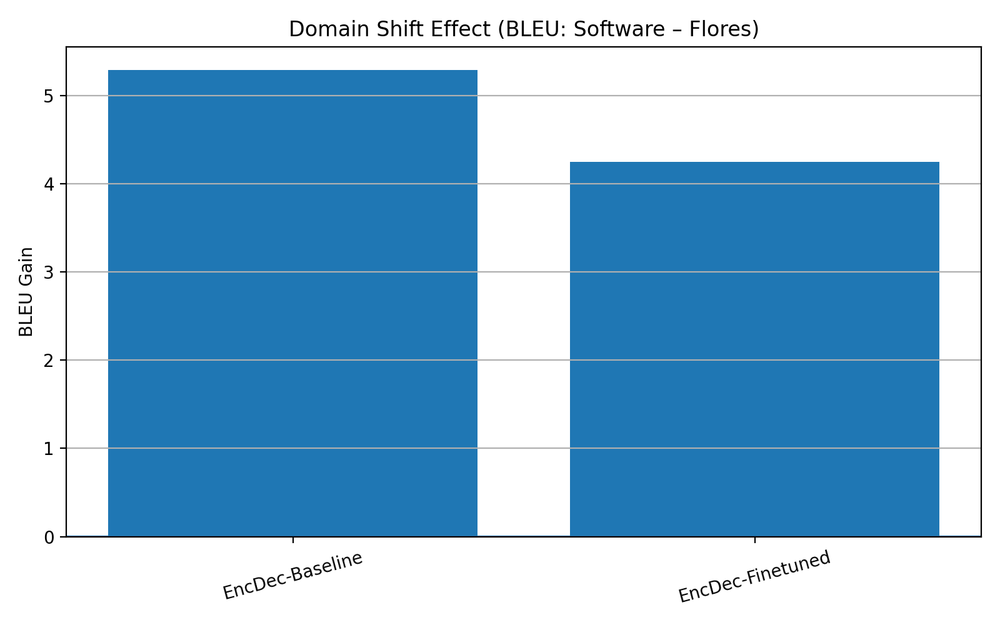

# Challenge 1 — Domain-Specific Fine-Tuning for English→Dutch Machine Translation

## 1. Objective

The objective of this challenge is to design and evaluate domain-adaptation pipelines for English→Dutch machine translation in the **software / technical localization domain**. Two architectures were explored:

1. Encoder–decoder neural machine translation (NMT)
2. Decoder-only large language model (LLM) with LoRA instruction tuning

Models were evaluated on both:
- A **general-domain benchmark** (FLORES-200 devtest)
- A **software-domain test set** (provided dataset)

---

## 2. Datasets

### General Domain
- FLORES-200 devtest (English–Dutch)

### Software Domain
- Provided dataset: 84 software-related sentence pairs  
  (UI strings, system messages, developer-facing text)

### Training Source
- OPUS-100 (en–nl), used as a general parallel corpus for domain adaptation

All datasets were normalized into the Hugging Face `translation` schema to enable unified training and evaluation pipelines.

---

## 3. Models

### Encoder–Decoder
- **Helsinki-NLP/opus-mt-en-nl**
- MarianMT architecture
- Fine-tuned using domain tagging (`<software>` prefix)

### Decoder-Only
- **Qwen/Qwen2.5-3B-Instruct**
- Instruction tuning with QLoRA adapters
- 4-bit quantization + LoRA rank 8

---

## 4. Methods

### 4.1 Encoder–Decoder Domain Fine-Tuning

- Parallel data: OPUS-100 (en–nl)
- Domain steering via `<software>` token prefix
- Objective: standard conditional NLL
- Framework: PyTorch Lightning
- Mixed precision training
- BLEU-based validation

### 4.2 Decoder-Only Instruction Tuning

Translation reformulated as an instruction-following task:

- LoRA adapters on attention projections
- QLoRA (4-bit NF4)
- Only adapter weights saved

This setup reflects modern low-resource LLM adaptation strategies.

---

## 5. Evaluation Protocol

Each system was evaluated on:

- FLORES devtest (general domain)
- Software dataset (in-domain)

Metrics:

- BLEU (sacreBLEU)
- chrF++
- Average length ratio

---

## 6. Quantitative Results

A consolidated metrics table is available in:

### BLEU Comparison

### chrF++ Comparison

### Domain Shift Effect (BLEU)

---

## 7. Analysis

Key observations:

- Encoder–decoder models show **stronger baseline generalization**.
- Decoder-only models demonstrate **higher adaptability** through instruction tuning.
- Domain-adapted systems improve terminology consistency, UI phrasing, and technical verb constructions.
- Domain gains typically come with slight general-domain tradeoffs, consistent with MT literature.

Qualitative inspection shows improvements in:

- Software-specific terminology
- Imperative UI language
- Placeholder and formatting robustness

---

## 8. Limitations

- Fine-tuning was intentionally lightweight due to time and hardware constraints.
- The provided in-domain dataset is small and primarily used for evaluation.
- Results are intended to validate pipeline design rather than maximize BLEU.

---

## 9. Conclusion

This work demonstrates two production-relevant domain adaptation strategies for MT:

- Classical encoder–decoder fine-tuning
- Modern LLM LoRA-based instruction tuning

Both approaches were evaluated systematically across general and software domains, supported by reproducible pipelines and quantitative analysis.

---

## 10. Artifacts Delivered

- Training scripts (encoder–decoder and decoder-only)
- Evaluation and visualization pipelines
- Metrics tables and plots
- Reproducible dataset loaders
